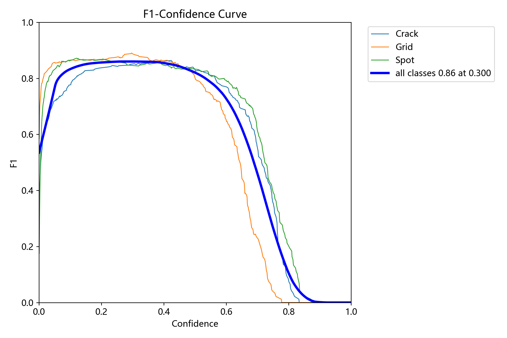
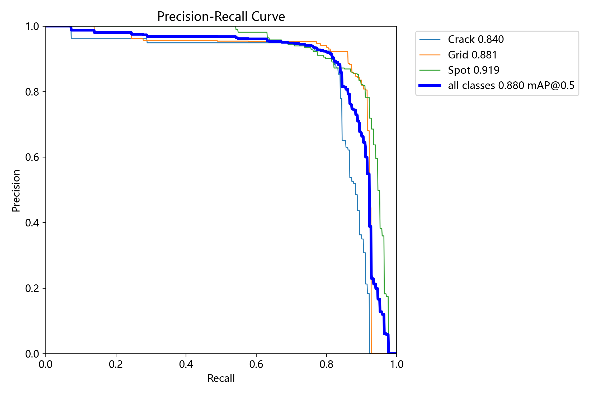
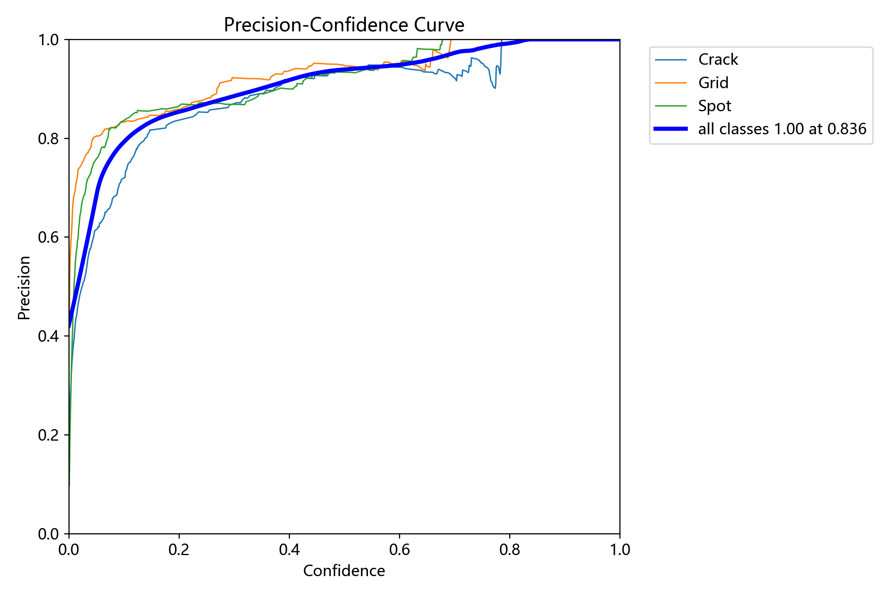
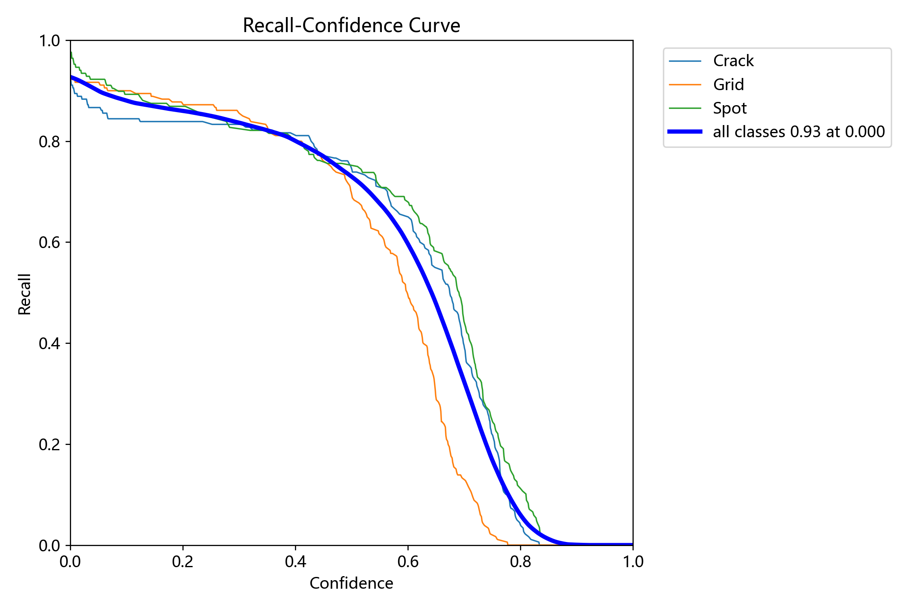
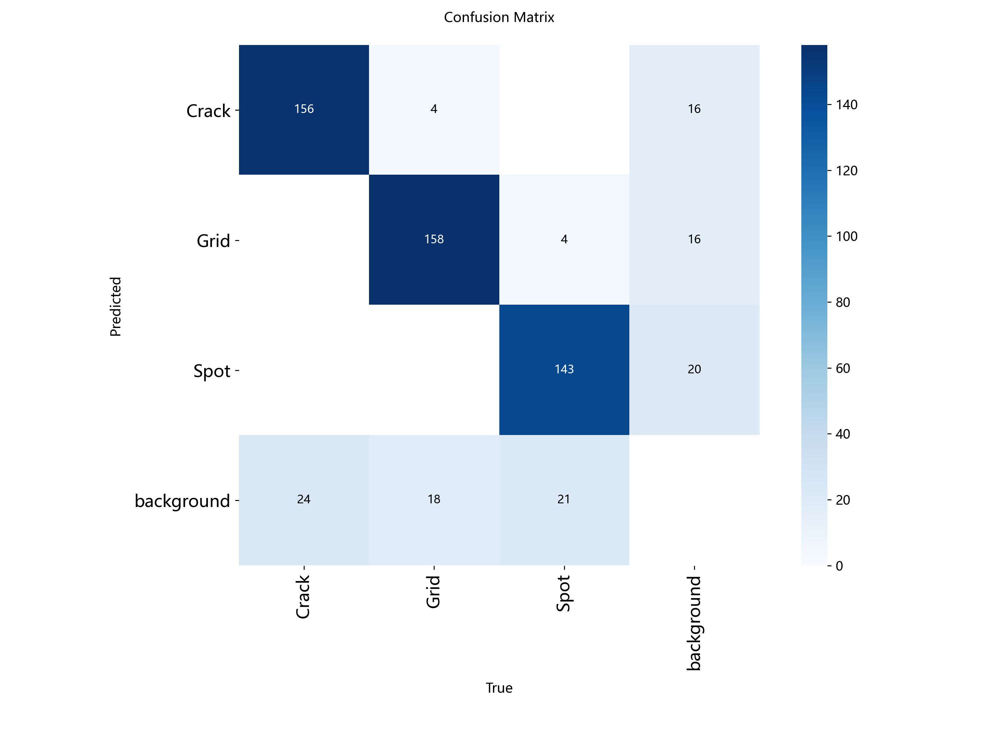
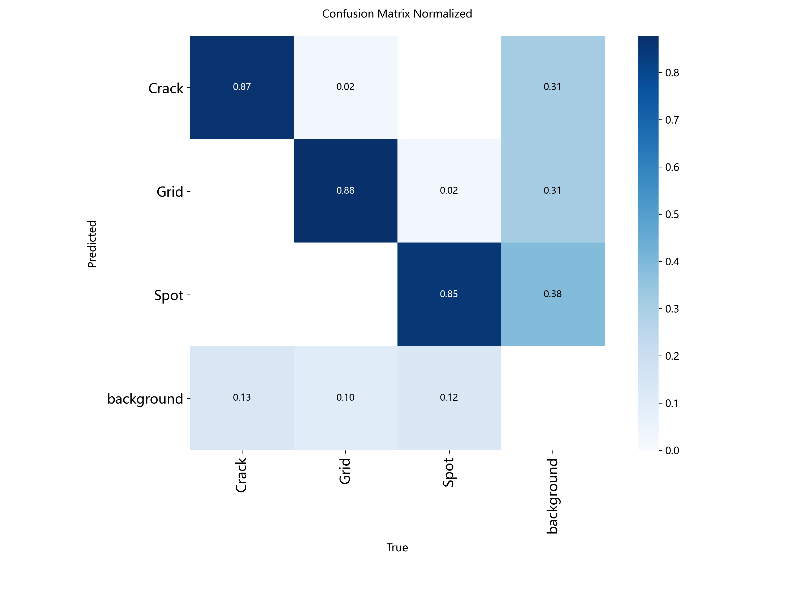

# YOLOv8 目标检测项目 (Crack / Grid / Spot)


> **项目简介**：基于 YOLOv8 实现目标检测，支持图片、屏幕画面、视频检测。包含模型训练与评估全套代码。本项目针对 Crack（裂缝）、Grid（网格）、Spot（斑点）三类目标进行检测，用于考研复试展示。训练结果 **mAP50 达到 0.8801**，单张图片推理仅需 **4.1ms**。

## 目录

- [项目简介](#项目简介)
- [项目目录结构](#项目目录结构)
- [数据集说明](#数据集说明)
- [环境依赖](#环境依赖)
- [快速开始](#快速开始)
- [模型权重](#模型权重)
- [训练结果展示与分析](#训练结果展示与分析)
- [推理速度](#推理速度)
- [未来改进方向](#未来改进方向)

## 项目目录结构

```text
panel-2/
├── src/                          # 源代码文件夹
│   ├── train.py                  # 模型训练脚本
│   ├── model_eval.py             # 模型评估脚本
│   ├── screen_detect_normal.py   # 屏幕检测普通版
│   ├── screen_detect_enhance.py  # 屏幕检测增强版
│   ├── video_detect_normal.py    # 视频检测普通版
│   └── video_detect_enhance.py   # 视频检测增强版
├── dataset/                      # 数据集文件夹
│   └── data.yaml                 # 数据集配置文件（不含图片，图片体积过大不上传）
├── assets/                       # 训练结果图表文件夹（用于README展示）
├── best.pt                       # 训练完成的最优权重
├── .gitignore                    # Git 忽略文件配置
└── README.md                     # 项目说明文档
```

## 数据集说明

- **数据来源**：[请替换为你的实际来源，如：某工业缺陷检测公开数据集 / 自建数据集]
- **类别数**：3 类
- **类别名称**：Crack（裂缝）、Grid（网格）、Spot（斑点）
- **验证集数据量**：共 **480 张**图片，**528 个**标注实例。
  - Crack：168 张图片，180 个实例
  - Grid：172 张图片，180 个实例
  - Spot：164 张图片，168 个实例
- **注意**：由于数据集图片体积过大，GitHub 仓库中仅保留了配置文件 `dataset/data.yaml`。如需复现实验，请下载数据集并解压至 `dataset/` 目录下。

## 环境依赖

- Python >= 3.8
- PyTorch >= 2.0
- ultralytics >= 8.0.0
- opencv-python
- matplotlib

安装依赖：
```bash
pip install ultralytics opencv-python matplotlib
```

## 快速开始

### 1. 模型训练
```bash
python src/train.py
```

### 2. 模型评估
```bash
python src/model_eval.py
```
评估完成后，终端会输出详细指标，可视化图表自动保存在 `runs/detect/val/` 目录下。

### 3. 屏幕实时检测
```bash
# 普通版（低延迟）
python src/screen_detect_normal.py
# 增强版（高精度）
python src/screen_detect_enhance.py
```
按 `q` 键退出检测。

### 4. 视频检测
```bash
# 普通版
python src/video_detect_normal.py
# 增强版
python src/video_detect_enhance.py
```

## 模型权重

训练完成的最优权重 **`best.pt`** 已存放在项目根目录，可直接用于推理或继续训练。

### 📈 整体评估指标

| 指标 | 数值 |
| :--- | :---: |
| **mAP@0.5 (all classes)** | **0.8801** |
| **mAP@0.5:0.95 (all classes)** | **0.4576** |
| Precision (all classes) | 0.887 |
| Recall (all classes) | 0.838 |

### 📊 各类别详细指标

| 类别 | 图片数 | 实例数 | Precision | Recall | mAP@0.5 | mAP@0.5:0.95 |
| :---: | :---: | :---: | :---: | :---: | :---: | :---: |
| Crack | 168 | 180 | 0.870 | 0.833 | 0.840 | 0.451 |
| Grid | 172 | 180 | 0.922 | 0.855 | 0.881 | 0.447 |
| Spot | 164 | 168 | 0.868 | 0.825 | 0.919 | 0.474 |
| **所有类别** | **480** | **528** | **0.887** | **0.838** | **0.880** | **0.458** |

## 训练结果展示与分析

以下图表来自验证集评估结果（均已保存在 `assets/` 文件夹）：

### 1. F1-Confidence Curve

**分析**：所有类别的综合 F1-score 在置信度阈值为 0.300 时达到最高值 0.86。Crack 和 Grid 类别在中等置信度区间表现平稳且优异。

### 2. Precision-Recall Curve (PR Curve)

**分析**：所有类别的平均精度 mAP@0.5 为 0.880。其中 Spot 类表现最好（AP 0.919），Grid 类次之（AP 0.881），Crack 类稍弱（AP 0.840）。

### 3. Precision-Confidence Curve

**分析**：当置信度设定为 0.836 时，所有类别的精确率（Precision）达到 1.00。这表明模型在较高置信度输出时具有极高的预测可靠性。

### 4. Recall-Confidence Curve

**分析**：在低置信度（0.000）时，模型召回率（Recall）高达 0.93。说明模型能够较全面地覆盖真实目标，漏检率低。

### 5. Confusion Matrix (混淆矩阵)



**分析**：
- 归一化混淆矩阵显示，Crack 识别正确的比例为 0.87，Grid 为 0.88，Spot 为 0.85。
- 背景误检率极低，说明模型能有效区分目标与背景。
- Spot 类有少量（约 12%-13%）被误判为 Crack 或 Grid，可能与这三类目标在部分图像中特征相似或存在遮挡有关，这是未来优化的重点。

## 推理速度

在测试环境（GPU 推理）下，单张图片的性能表现极佳：
- 预处理 (Preprocess)：0.3ms
- 推理 (Inference)：4.1ms
- 后处理 (Postprocess)：0.6ms

## 未来改进方向

- 针对 Spot 类的误判现象，引入注意力机制（如 CBAM、SE）提升特征区分度。
- 尝试 TensorRT 加速推理，进一步提升视频检测的实时帧率。
- 扩充 Crack 类别的训练样本，平衡各类别间的 AP 差异。
- 尝试使用 YOLOv8s 或 YOLOv8m 等更大模型，对比 mAP 与推理速度的权衡。

## 致谢

- 感谢 [Ultralytics](https://github.com/ultralytics/ultralytics) 提供的 YOLOv8 框架。
- 感谢 [数据集来源](https://aistudio.baidu.com/datasetdetail/220416)提供的数据支持。

---
**作者**：Qiu903  
**邮箱**：1484052468@qq.com  
**仓库地址**：https://github.com/Qiu903/YOLOv8-panel